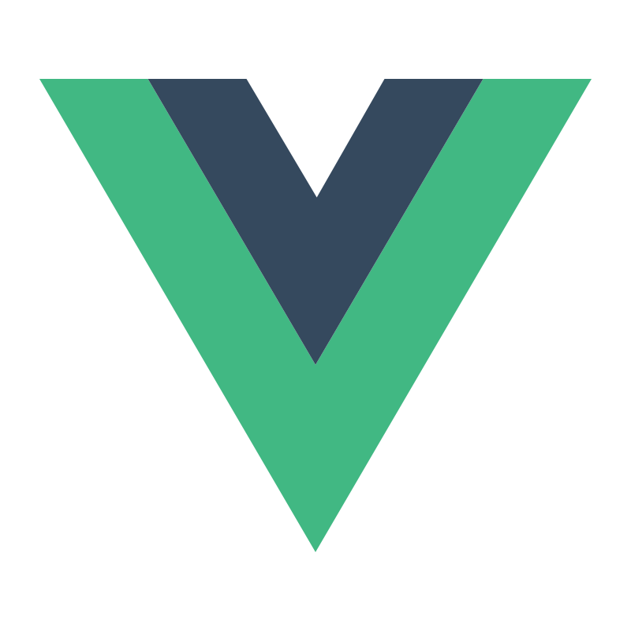
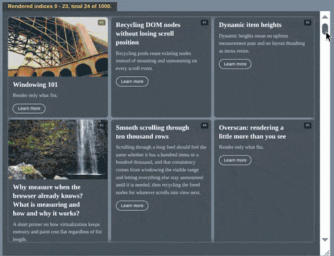

# Layout virtual
[![License][]](https://opensource.org/licenses/MIT)
[![Build Status]](https://github.com/itihon/layout-virtual/actions/workflows/deploy-homepage.yml)
[![NPM Package]](https://npmjs.org/package/layout-virtual)
[![Code Coverage]](https://codecov.io/gh/itihon/layout-virtual)
[![semantic-release]](https://github.com/semantic-release/semantic-release)

[License]: https://img.shields.io/badge/License-MIT-blue.svg
[Build Status]: https://github.com/itihon/layout-virtual/actions/workflows/deploy-homepage.yml/badge.svg
[NPM Package]: https://img.shields.io/npm/v/layout-virtual.svg
[Code Coverage]: https://codecov.io/gh/itihon/layout-virtual/branch/master/graph/badge.svg
[semantic-release]: https://img.shields.io/badge/%20%20%F0%9F%93%A6%F0%9F%9A%80-semantic--release-e10079.svg

Framework agnostic virtualization engine for responsive list and grid layout. 

## Features: 
  - **No** item wrappers. Renders items as is, as if they are sitting in a regular container. 
  - **No** measurements; **no** estimated sizes are required from the application code.
  - **No** separate components for lists and grids; the difference is only in CSS styling. 
  - **No** binary search, **no** tree-like data structures, **no** item size caching under the hood, which results in faster list initialization, lower memory consumption, and smaller bundle size. Just pure math and precise scroll position calculation regardless of item sizes, margins, and gaps.
  - **No** blank canvas in desktop Chrome during fast scrolling.

| Package | Bundle size |
| -------- | -------- |
| layout-virtual |  |
| react-layout-virtual |  |
| vue-layout-virtual |  |
| angular-layout-virtual |  |

## Installation and usage

See the **[library homepage](https://itihon.github.io/layout-virtual/)** for details.

<!-- <video controls width="480" loop>
  <source src="./homepage/src/assets/simplescreenrecorder-2026-07-06_15.08.42-ezgif.com-mkv-to-webm-converter.webm" type="video/webm" />

  <source src="./homepage/src/assets/simplescreenrecorder-2026-07-06_15.08.42-ezgif.com-video-compressor.mp4" type="video/mp4" />
</video> -->